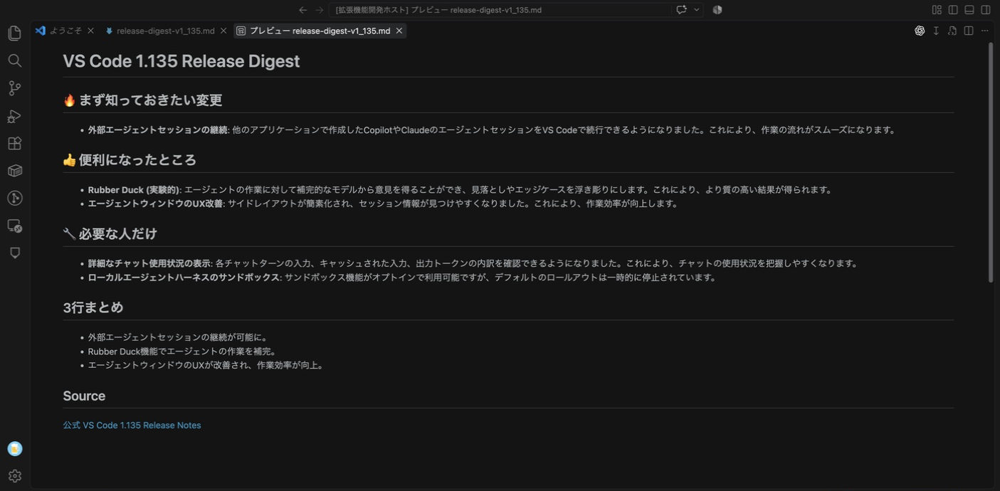

# Release Digest for Visual Studio Code

VS Codeは頻繁に更新されますが、毎回長い英語Release Notesを読み切るのは大変です。Release Digestは、現在のVS Code Release Notesから重要な変更と利用者への影響をAIで短く整理し、アップデート内容を把握する時間を減らします。

単なる全文翻訳ではなく、「まず知っておきたい変更」「便利になったところ」「必要な人だけ」に分けた日本語Digestを生成します。

## Release Digestとは

Release Digestは、現在利用中のVS Codeバージョンに対応する公式Release Notesを取得し、VS Code Language Model APIで日本語に要約するVS Code Extensionです。要約結果はVS Code標準Markdown Previewで表示されます。

## 主な機能

### VS Codeのアップデート内容をAIで短く要約

長い公式Release Notesから、押さえておきたい変更と利用者への影響を日本語で簡潔にまとめます。

### 重要な変更からすぐ確認

「まず知っておきたい変更」「便利になったところ」「必要な人だけ」に整理し、重要な変更から短時間で確認できます。

### VS Codeのアップデートを検知

VS Codeのバージョン更新時に通知し、そこからDigestを生成できます。

### いつでもCommand Paletteから生成

現在利用中のVS Codeバージョンについて、好きなタイミングでDigestを生成できます。

### 公式Release Notesもすぐ確認

DigestのSourceリンクから公式Release Notesへ移動し、気になった変更の詳細を確認できます。

## 使い方

1. Command Paletteを開きます。
2. **Release Digest: 現在のVS Code Release Notesを要約** を実行します。
3. 必要に応じてLanguage Model APIの利用を許可します。
4. 要約が完了すると、DigestがVS Code標準Markdown Previewで表示されます。

VS Code更新後は、表示される通知からもDigestを生成できます。

## 出力イメージ



## 動作要件

- VS Code 1.91以降。
- VS Codeで利用可能なGitHub Copilot Language Model。

モデルの利用可否、同意、クォータ、適用条件はVS CodeおよびGitHub Copilotによって管理されます。

## プライバシー

- `https://code.visualstudio.com` から公開Release Notesを取得します。
- 抽出した公開Release Notes本文を、VS Code Language Model API経由で言語モデルへ送信します。
- workspace内のファイル、ソースコード、個人情報は読み取りません。
- 独自サーバー、独自APIキー、アカウント、テレメトリ、データベースは使用しません。

## 現在の制約

- 出力言語は日本語のみです。
- 対象は現在利用中のVS Codeバージョンのみです。
- Release Notes取得にはネットワーク接続が必要です。
- 要約には利用可能なLanguage Modelとクォータが必要です。

## 開発

```sh
npm install
npm run build
npm run lint
npm test
npm run package
```

VS CodeでF5キーを押すと、Extension Development Hostが起動します。
